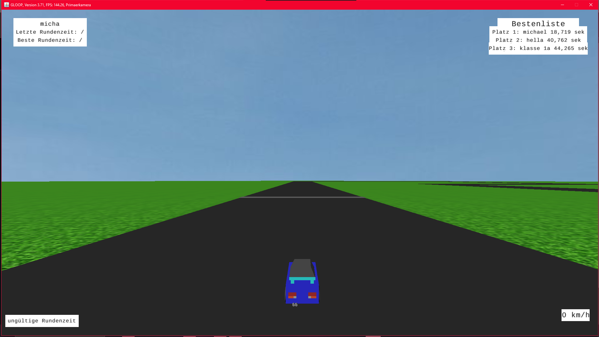

Zuletzt ausgeführt 30.09.2024 mit GLOOP 3.7 und JavaSE-11
(Schnelligkeit des Spiels könnte Abhängig von der PC-Leistungsstärke sein)

PROJEKTBEZEICHNUNG: Rennszene
PROJEKTZWECK: Bildung
VERSION oder DATUM: 14.09.2022 Vers3
WIE IST DAS PROJEKT ZU STARTEN: Spielverwalter.java ausführen
AUTOR: Michael Martynov
BENUTZERHINWEISE: Zunächst sollte der Name eingetippt werden und mit Enter bestätigt werden. Danach erscheint die Steuerung. 
Nachdem man Leertaste drückt um fortzufahren geht es auch schon los.
Solange man sich auf der Strecke befindet wird die Zeit gemessen. Dabei werden die Geraden in einen Array gepackt und die Daten wie etwa die breite abefragt. 
Kommt man von der Strecke ab, wird die Rundenzeit für ungültig erklärt. Erst wenn man wieder über das Ziel fährt beginnt eine neue Messung.
Über das Ziel fahren und sofort wieder zurück rollen klappt nicht.
Die besten 3 Rundenzeiten werden lokal gespeichert, genauso wie der zugehörige Fahrer und werden auf der Bestenliste rechts oben angezeigt.
Oben rechts hingegen befinden sich Informationen zur dezeitigen Session. Die letzte Rundenzeit wie 
die beste Rundenzeit die bei der ausführung des Programms gemacht wurde.
Die zusätzlichen Klassen, weleche nicht mit Rennszene verknüft sind geben einen Einblick in die bewältigung verschiedener kleinen Hürden.
Ich hoffe das Programm ist kompatibel und läuft fehlerfrei.
Möchte man die Bestenliste zurücksetzen, muss man einfach die Datei "besteZeitenSpeicher.sav" löschen

GLOOP 4.31 wurde mit einer neueren Java Version kompiliert. Setzt man die Java Version hoch, gibt es ein Fehler mit opengl:
`jogamp.opengl.windows.wgl.awt.WindowsAWTWGLGraphicsConfigurationFactory.chooseGraphicsConfigurationImpl(WindowsAWTWGLGraphicsConfigurationFactory.java:169)`

Daher lasse ich das Projekt erstmal bei 3.7 mit JavaSE-11